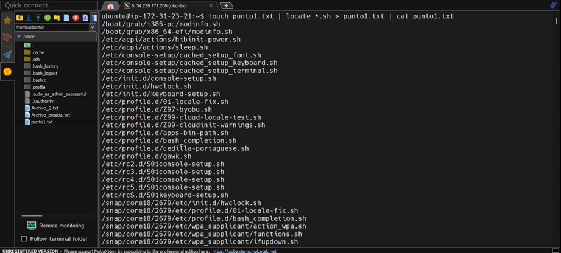
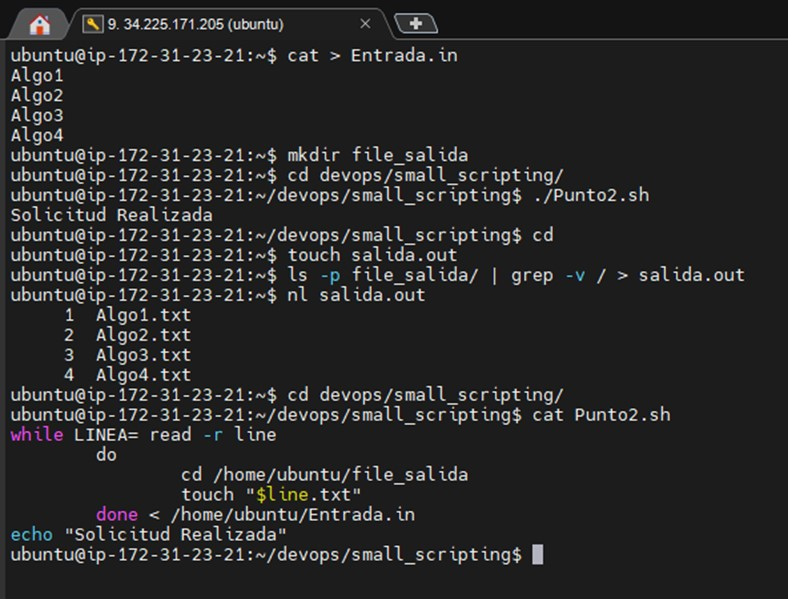
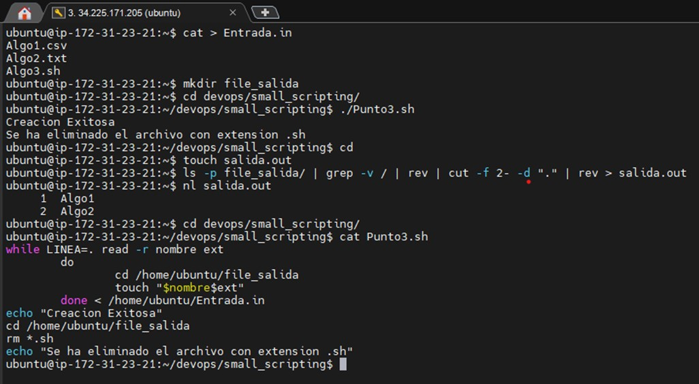
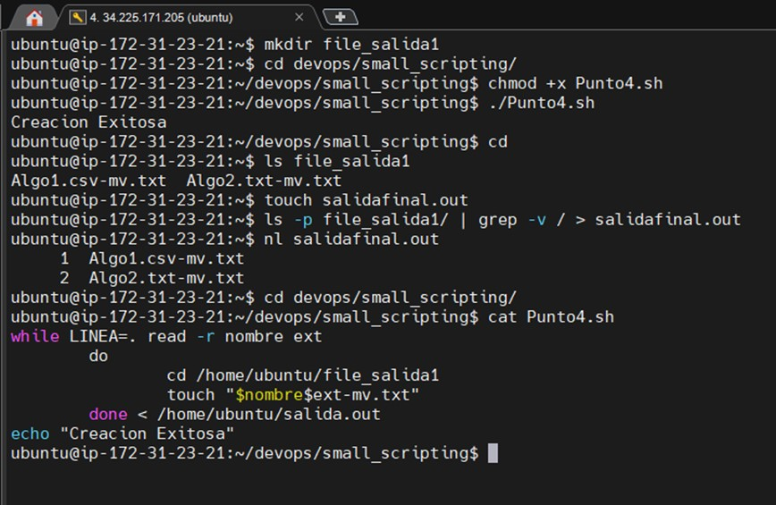

<h3>Willian Enrique Franco Campos--Banco Popular</h3>

<h1 align="center">Taller Sistema Operativo Punto 1</h1>

Buscar Archivos:
Se crea el archivo “punto1.txt”, se le dice al sistema que localice todos los archivos que tienen extension .sh y que la ruta de estos se almacene dentro del archivo creado  y que este muestre su contenido en la terminal.

Crear:
Se crea el archivo Entrada.in en el cual agrego una lista de cosas al azar (Algo1, Algo2, Algo3, Algo4), se crea un nuevo directorio llamado file_salida, se ejecuta un Shell el cual va a leer cada una de las líneas del archivo Entrada.in y le va agregar la extensión .txt, al agregar esa extensión cada uno de los elementos de ese documento se convertirá en un archivo los cuales se almacenaran en la carpeta file_salida, se creara un nuevo archivo en blanco el cual tiene como nombre salida.out, el nombre de los archivos que se encuentran en file_salida será agregado en forma de lista con su respectiva extensión en el archivo salida.out, y por último se imprimirá en el terminal el contenido de ese archivo.

Eliminar:
Se crea el archivo Entrada.in en el cual agrego una lista de cosas al azar con diferentes extensiones(Algo1.csv, Algo2.txt, Algo3.sh), se crea un nuevo directorio llamado file_salida, se ejecuta un Shell el cual va a leer cada una de las líneas del archivo Entrada.in y le va agregar la extensión con la cual esta en el archivo al mismo tiempo ese Shell va a detectar el archivo que tiene como extensión “.sh” y lo eliminara de la carpeta donde esta ubicado, se creara un nuevo archivo en blanco el cual tiene como nombre salida.out, el nombre de los archivos que se encuentran en file_salida será agregado en forma de lista sin extensión en el archivo salida.out, y por último se imprimirá en el terminal el contenido de ese archivo que en esta ocasión son solo dos archivos que eran aquellos que no tenían la extensión “.sh”.

Renombrar:
Se crea una carpeta llamada file_salida1, ejecutamos un Shell que va a coger los nombres de los archivos que se encuentran en el documento salida.out (del punto anterior) y a cada uno lo renombrara con “-mv.txt” y los almacenara en la carpeta de file_salida1, comprobamos que la creación de los archivos haya sido exitosa, creamos un nuevo documento vacio con el nombre salidafinal.out, agregamos el nombre de los archivos de la carpeta file_salida1 con sus respectivas extensiones, y por ultimo mostramos el listado de los elementos en el interior de ese archivo en la consola.

