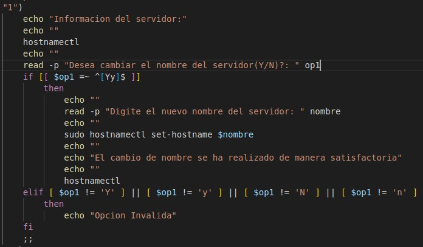
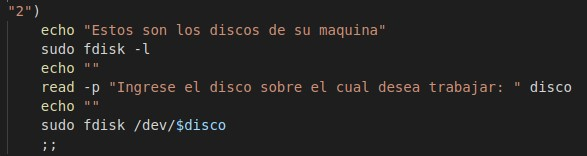
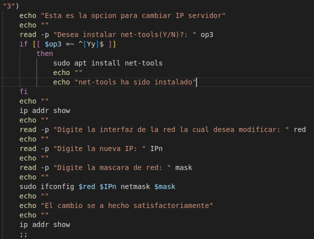
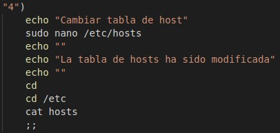
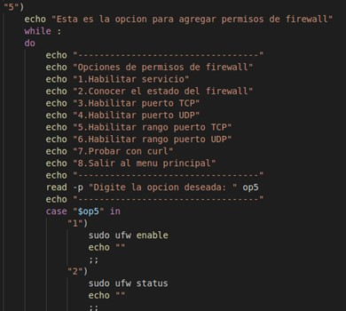
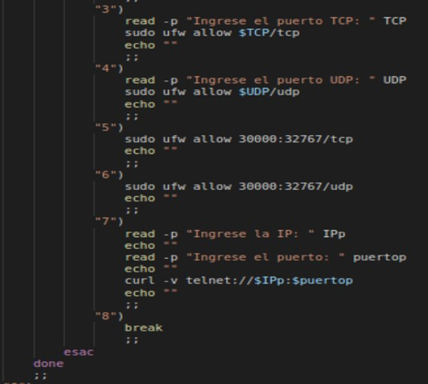
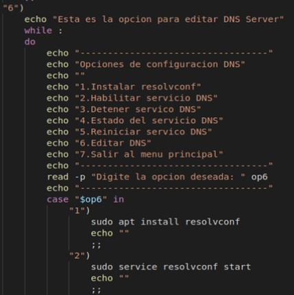
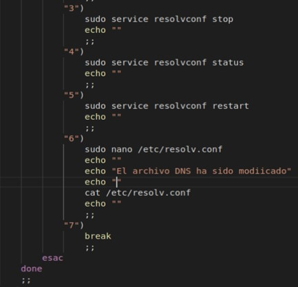
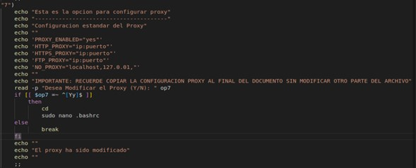

<h3>Willian Enrique Franco Campos--Banco Popular</h3>

<h1 align="center">Taller Sistema Operativo Punto 2</h1> 

Se hace la creación de un menú principal de manejo del sistema dentro de un ciclo while, el cual tiene las siguientes opciones:

1.	Cambiar nombre del servidor:

En esta opción al usuario se le presenta la información detallada del servidor en el cual se encuentra, después el sistema le preguntara si desea hacer modificación en el nombre de este, si el usuario responde con “Y” o “y” el sistema la preguntara el nuevo nombre del servidor el cual será almacenado dentro de la variable “$nombre”, y por medio del comando “sudo hostnamectl set-hostname $nombre” realizara el cambio en el sistema, para finalizar se le mostrara al usuario que el cambio se realizo de forma correcta; en el caso que el usuario digite una opción diferente a las indicadas en la primera pregunta se le informara que su opción es invalida y lo enviara al menú principal.

  

2.	Cambiar partición de discos:

Al seleccionar esta opción lo primero será mostrarle al usuario los discos que están en su máquina, después se le solicitara el nombre del disco sobre el cual desea trabajar, de forma automática el sistema le dará al usuario varias opciones para que este haga lo que desee con el disco seleccionado.

  

3.	Cambiar IP del servidor:

En esta opción se le preguntara al usuario si desea instalar net-tools en la maquina (esta opción es para usuarios nuevos que nunca hayan hecho esta operación) al seleccionar la opción de “Y” o “y” el sistema la instalara de forma automática, después desplegara el nombre de las redes que tiene el sistema con toda la información de estas, se le solicitara al usuario el nombre de la red que desea modificar, la IP nueva, y la máscara; se realizara el cambio de la IP en la red seleccionada y se le mostrara al usuario la nueva IP con su respectiva mascara en la información de la red.
ADVERTENCIA: Hacer el cambio de IP solo si la maquina es local, en el caso de que sea una maquina virtual esta se desconectara impidiendo que el usuario siga trabajando.  

  

4.	Cambiar tabla de host:

El usuario tendrá un control total del archivo hosts en el cual podrá agregar, modificar o eliminar todos los hosts que desee y las veces que lo crea necesario.

  

5.	Agregar permisos de firewall:

En esta opción se desplegará un nuevo menú el cual tendrá las siguientes opciones:

  *	Habilitar servicio
  *	Conocer el estado de firewall
  *	Habilitar puerto TCP
  *	Habilitar puerto UDP
  *	Habilitar rango de puerto TCP
  *	Habilitar rango de puerto UDP
  *	Probar con curl
 
Al seleccionar cualquiera de las opciones anteriormente mencionadas el sistema ejecutara de forma automática el respectivo comando para cumplir con lo requerido por el usuario, en el caso de la opción 3 y 4 al usuario deberá ingresar el puerto que desea habilitar, y en la opción 7 deberá ingresar la IP y el puerto con el cual desea arrojar la prueba.
  

  

  

  
6.	Editar DNS Server:

Al entrar en esta opción se desplegara otro menú el cual tiene las siguientes opciones:

*	Instalar resolvconf
*	Habilitar servicio DNS
*	Detener servicio DNS
*	Estado del servicio DNS
*	Reiniciar servicio DNS
* Editar DNS

La primera opción es mas para usuarios nuevos que no hayan instalado el resolvconf, es importante que este sea instalado para que las otras opciones se ejecuten de manera correcta y sin ningún tipo de error; las otras opciones se ejecutaran de forma automática dentro del sistema, en la opción 6 se le dará total control al usuario para que este modifique el archivo DNS y lo organice a sus necesidades.

  

  

7.	Configurar Proxy:

En esta opción al usuario se le presenta un formato estándar de la modificación del proxy ya que al hacer la modificación por primera vez, el archivo que contiene esta información vendrá sin nada relacionado con el proxy por defecto, se le preguntara al usuario si desea hacer algún tipo de modificación a este archivo, en el caso de ser una respuesta afirmativa se le dará un control total del archivo al usuario; antes de dar acceso se le recuerda al usuario en donde deberá establecer la configuración del proxy y se le indicara que no debe hacer ningún tipo de modificación al resto del archivo.

  

