Willian Enrique Franco Campos-------Banco Popular

***<h1 align="center">Taller de Docker</h1>***

## Primera Parte:

* Configuracion de herramientas de desarrollo:

Descargamos la herramientas de Visual Studio Code y MobaXterm, en el caso del VSC configuramos el entorno a nuestro gusto y las extensiones que creamos necesarias, es importante dejar configurado la herramienta de GitBash en el entorno para asi trabajar los comandos de Git en los repositorios que trabajemos de manera local; en el MobaXterm configuramos el entorno de trabajo con la IP que nos es asignada por AWS y la llave que estos nos facilitan para tener el acceso correspondiente a la maquina asignada.

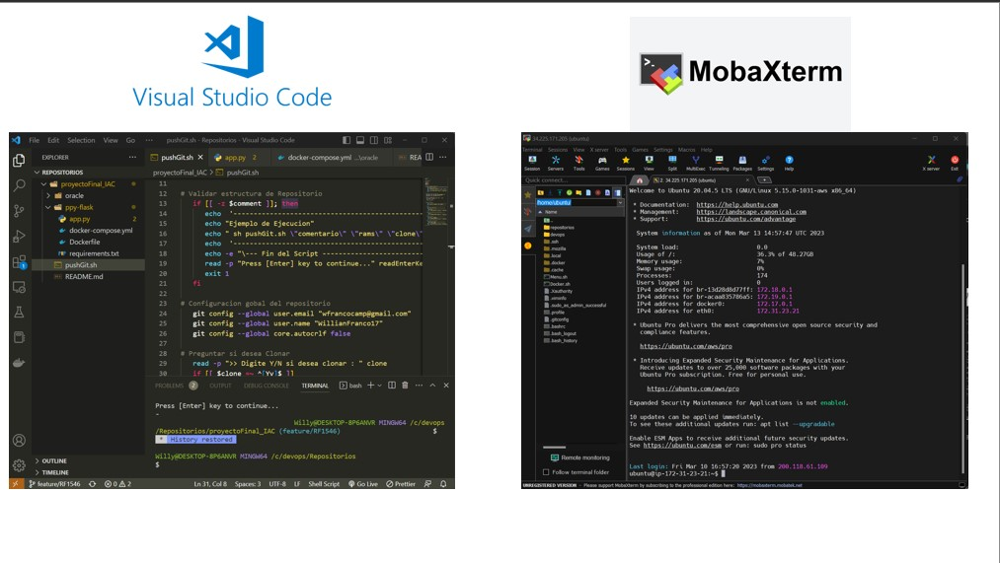

* Crear cuenta en GitHub:

Ingresamos al enlace: https://github.com/join, completamos el formulario y confirmamos la cuenta en el correo con el cual nos inscribimos.

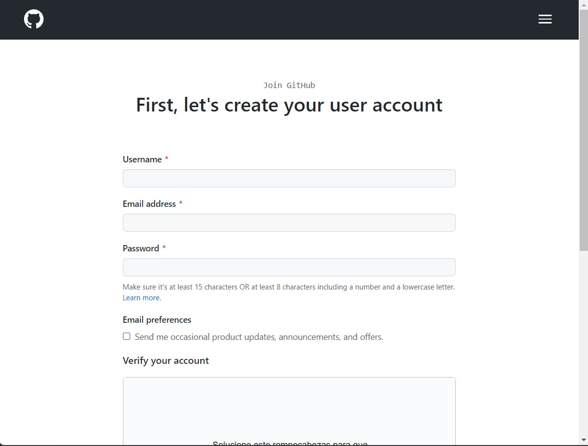

Cuando la cuenta esta creada podemos personalizarla a nuestro gusto y comenzar a crear nuestros repositorios.

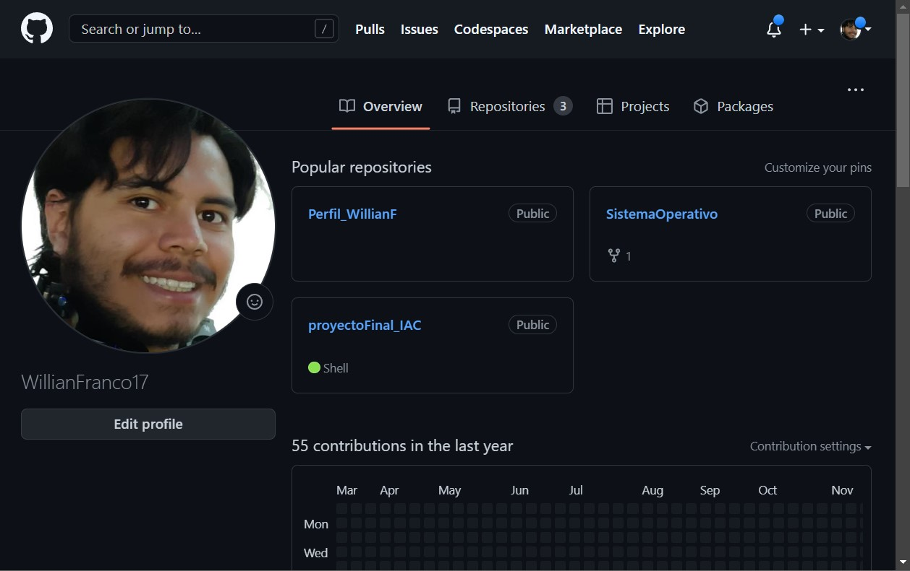

* Crear cuenta en DockerHub:

Ingresamos al enlace: https://hub.docker.com/signup, completamos el formulario y confirmamos la cuenta en el correo con el cual nos inscribimos.

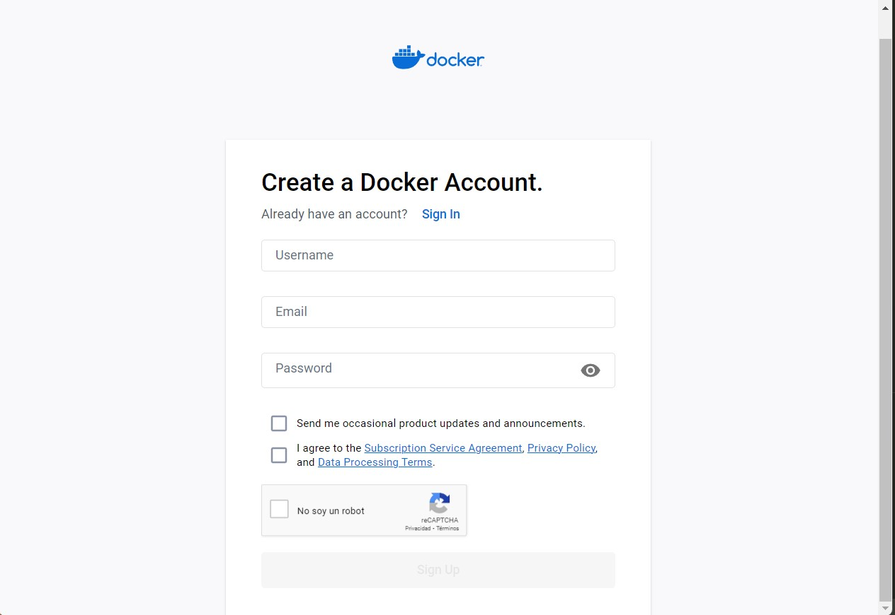

Cuando la cuenta esta creada podemos comenzar a crear nuestros repositorios.

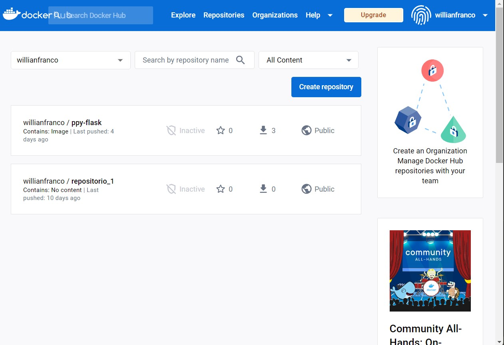

* Creacion del Repositorio:

En la ventana de nuestro perfil seleccionamos la pestaña de repositorios, y en esta seleccionamos el boton verde que dice "New"

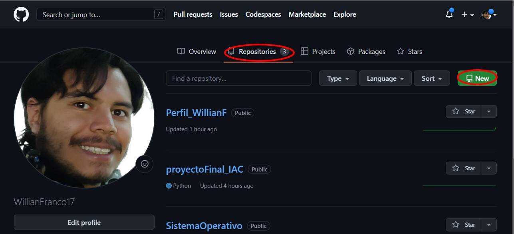

Se despliega una nueva ventana en la cual establecemos el nombre de nuestro repositorio, el dominio que este va a tener, y si queremos incluir un archivo README.md

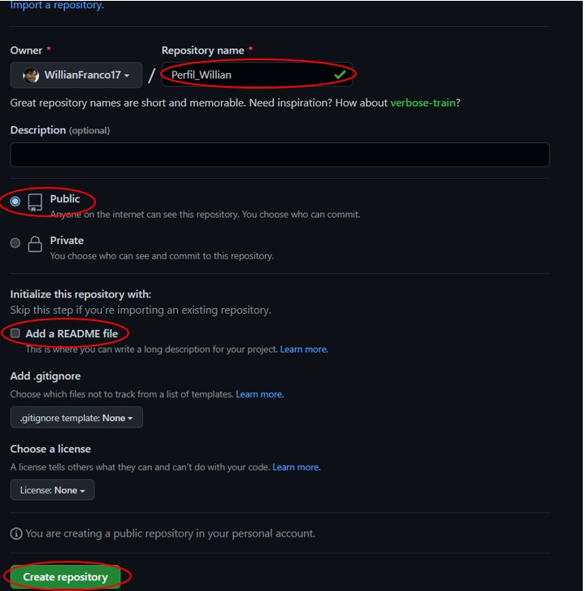

* Configuracion de llaves SSH

1. Extraccion de la llave de GitHub:

En nuestra imagen ingresamos el comando "ssh-keygen", dependiendo la ruta que este nos de las escribimos con el comando "cat" y asi obtndremos la infomacion de la llave ssh de nuestra maquina, este proceso funciona tanto para maquinas virtuales como de manera local.

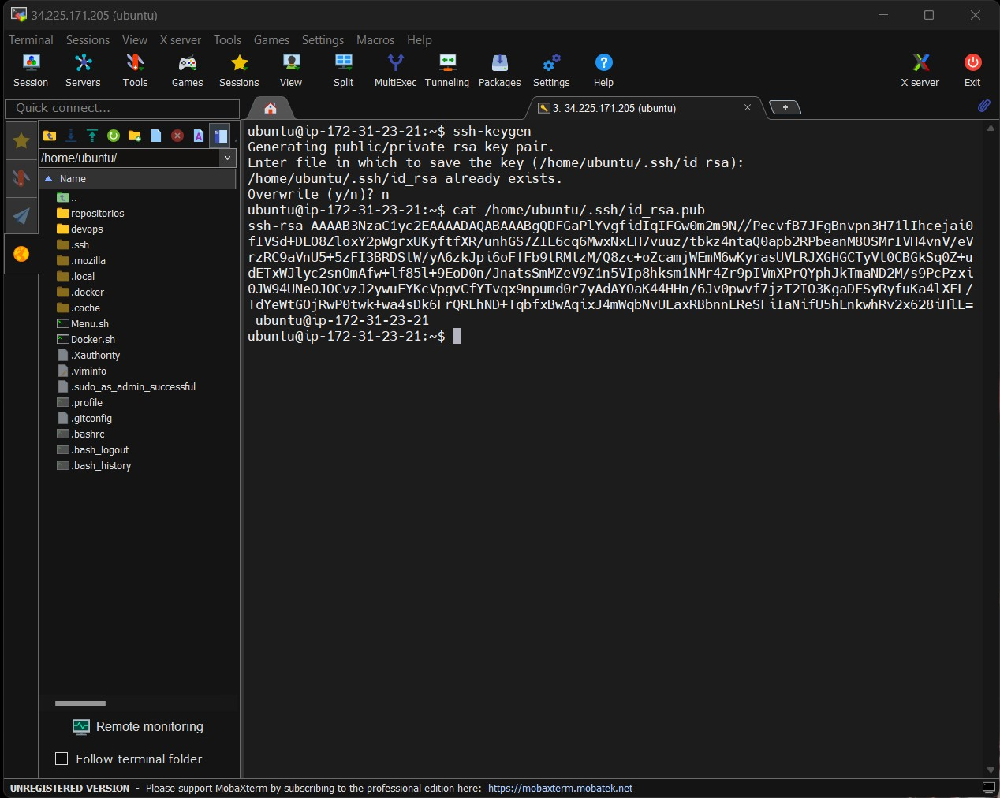

2. Agregar llave en GitHub:

* En la pagina principa en la parte superior derecha desplegamos las opciones y seleccionamos la que die "Settings"

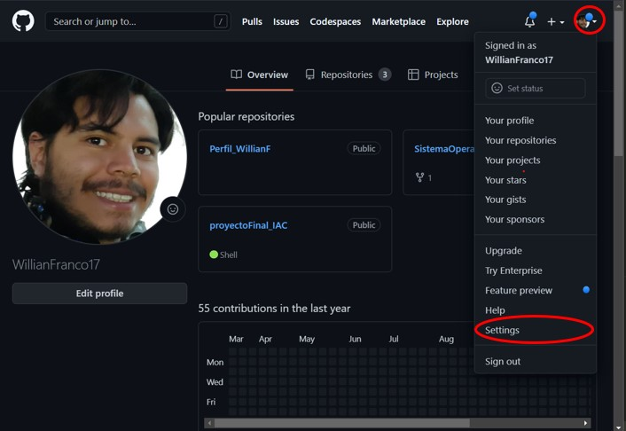

* Dentro de esta opcion nos dirijimos a la columna izquierda y seleccionamos la opcion de "SSH and GPG keys"

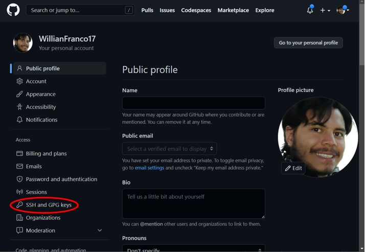

* En ese ventana damos click en la opcion "New SSH key"

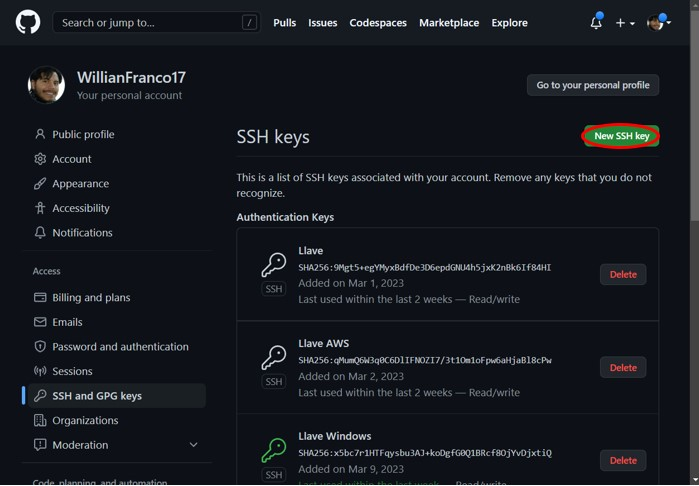

* Establecemos el nombre que va a tener nuestra llave (ya que pueden haber mas llaves dependiendo los entornos de trabajo), y pegamos la informacion que extragimos de nuestro entorno de trabajo.

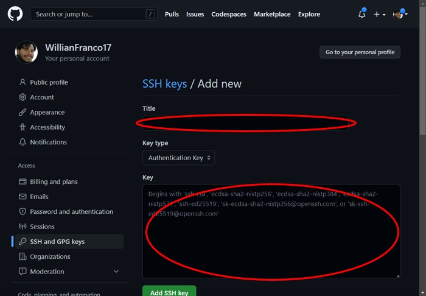

## Segunda Parte:

* Agregar modulo de instalacion Docker en menu de administracion:

En el archivo Menu.sh que se encuentra en la rama "gh-pages" se agrega la opcion "Instalar Docker".

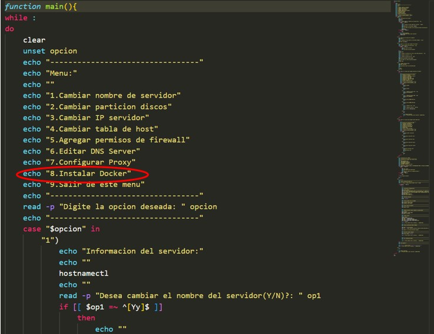

Al seleccionar esa opcion se ejecutaran la siguiente serie de comandos dentro de nuestra maquina

```shell
cd ~/

echo "-----------------------------------------------------------------------------"
echo "Instalación Prerequisitios"
echo "-----------------------------------------------------------------------------"
sudo apt-get update -y
sudo apt install apt-transport-https ca-certificates curl software-properties-common -y
curl -fsSL https://download.docker.com/linux/ubuntu/gpg | sudo apt-key add -
sudo add-apt-repository "deb [arch=amd64] https://download.docker.com/linux/ubuntu focal stable" -y
sudo apt update -y
apt-cache policy docker-ce 
sudo apt install docker-ce -y

echo "-----------------------------------------------------------------------------"
echo "Verificar Version"
echo "-----------------------------------------------------------------------------"
docker --version

echo "-----------------------------------------------------------------------------"
echo "Iniciar docker con el sistema"
echo "-----------------------------------------------------------------------------"
sudo systemctl enable docker
sudo systemctl start docker

echo "-----------------------------------------------------------------------------"
echo "Crear usuario de Docker"
echo "-----------------------------------------------------------------------------"
sudo adduser docker


echo "-----------------------------------------------------------------------------"
echo "Agregar permisos usuario ubunutu al grupo Docker"
echo "-----------------------------------------------------------------------------"
user=$(whoami)
sudo usermod -G docker $user
grep $user /etc/group

echo "-----------------------------------------------------------------------------"
echo "folder docker"
echo "-----------------------------------------------------------------------------"
folder=/Images
sudo mkdir -p $folder/$user
sudo mkdir -p $folder/$user/Data
sudo chown -R $user:$user $folder/$user
sudo chown -R $user:$user $folder/$user/Data
ls -ltr $folder/

read -p "Press [Enter] key to continue..." readEnterKey

echo "-----------------------------------------------------------------------------"
echo "Inicia instalacion Docker Compose                                            "
echo "-----------------------------------------------------------------------------"

sudo mkdir -p /usr/local/bin
sudo curl -L "https://github.com/docker/compose/releases/download/1.26.2/docker-compose-$(uname -s)-$(uname -m)" -o /usr/local/bin/docker-compose

sudo chmod +x /usr/local/bin/docker-compose

echo "-----------------------------------------------------------------------------"
echo "Verificar docker-compose"
echo "-----------------------------------------------------------------------------"
sudo docker-compose --version

read -p "Press [Enter] key to continue..." readEnterKey


echo "-----------------------------------------------------------------------------"
echo "Fin instalacion Docker                                                       "
echo "-----------------------------------------------------------------------------"

read -p "Press [Enter] key to continue..." readEnterKey
```

* Subir cambios a Repositorio:

Cuando trabajamos de manera local en nuestros respoitorios implementamos la siguiente serie de comandos para subir los respectivos cambios a nuestra cuenta de GitHub

```shell
#/bin/bash
clear

# set variables
#username=$1
#token=$2
#repo=$3
comment=${1}
rama=${2}
clon2=${3}

# Validar estructura de Repositorio
   if [[ -z $comment ]]; then
      echo  '---------------------------------------------------------------------'
      echo "Ejemplo de Ejecucion"
      echo " sh pushGit.sh \"comentario\" \"rams\" \"clone\" "
      echo  '---------------------------------------------------------------------'
      echo -e "\--- Fin del Script -------------------------"
      read -p "Press [Enter] key to continue..." readEnterKey
      exit 1
   fi

# Configuracion gobal del repositorio
   git config --global user.email "wfrancocamp@gmail.com"
   git config --global user.name "WillianFranco17"
   git config --global core.autocrlf false

# Preguntar si desea Clonar
   read -p ">> Digite Y/N si desea clonar : " clone
   if [[ $clone =~ ^[Yy]$ ]]
   then
      git clone $clone
   fi
   
# Pasos de Clonacion
   # Imprimir Variables
      echo -e "--------------------------------------------"  
      echo "comentario :[$comment] | rama :[$rama]"
      echo -e "--------------------------------------------"  
   
   # Status
      echo "--------------------------------------------"   
      echo "inicia carga en git"
      echo "--------------------------------------------"   
         git status
         echo "- Reporte Status----------------------------"
      read -p "Press [Enter] key to continue..." readEnterKey

   # Add todo slo scambios de la carpeta actual
      echo "--------------------------------------------"   
         git add .
         echo "- Agregar cambios locales ------------------"
      read -p "Press [Enter] key to continue..." readEnterKey
   
   # Agregar Comentario
      echo "--------------------------------------------"   
         git commit -m "$comment"
         echo "- Agregar Comenatario ---------------------"
      read -p "Press [Enter] key to continue..." readEnterKey

   # Subir cambios a la rama remota
      echo "--------------------------------------------"   
         git push origin $rama
         echo "- Subir a $rama --------------------------"
      echo "--- Fin del Script -------------------------"
      read -p "Press [Enter] key to continue..." readEnterKey
      # Pedira acceso de credenciales en github por front desde el visual code
#Fin Script
```
Para comodidad de todos los usuarios se automatizo este proceso para realizar los cambios y solo es necesario ejecutar alguno de los siguientes comandos:

      * Linux: ./pushGit.sh \"comentario\" \"rams\" \"clone\"
      * Windows: sh pushGit.sh \"comentario\" \"rams\" \"clone\"

* Clonar Repositorios:

Dentro de Github nos dirijimos al repositorio que deseamos clonar, ya dentro de este damos click en el boton que dice "Code", en la ventana que se despliega seleccionamos "HTTPS", y ese link es el que copiamos para la respectiva clonacion.

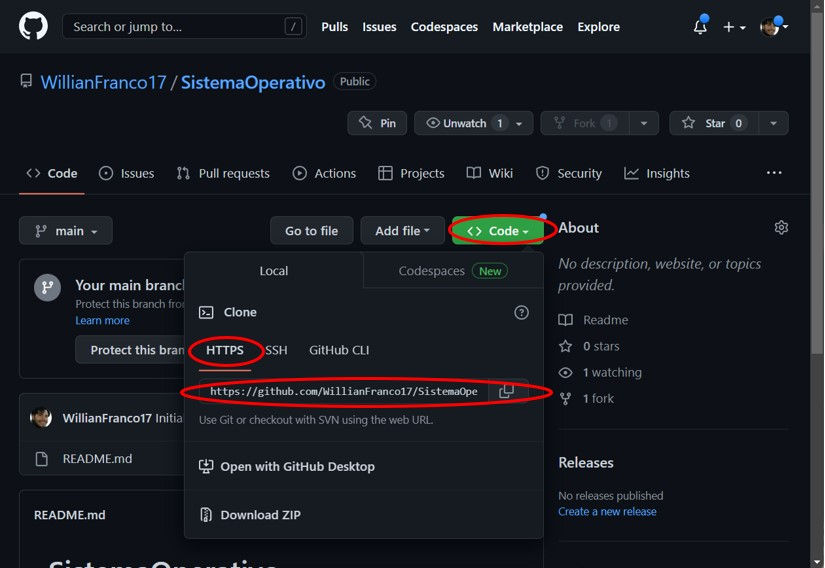

Ya dentro de nuestro entorno de trabajo nos dirijimos a la carpeta anteriormente creada donde se van a almacenar los repositorios, digitamos el comando "git clone" acompañado del link anteriromente copiado, y al dar Enter comenzara el clonado de ese repositorio en la carpeta seleccionada.

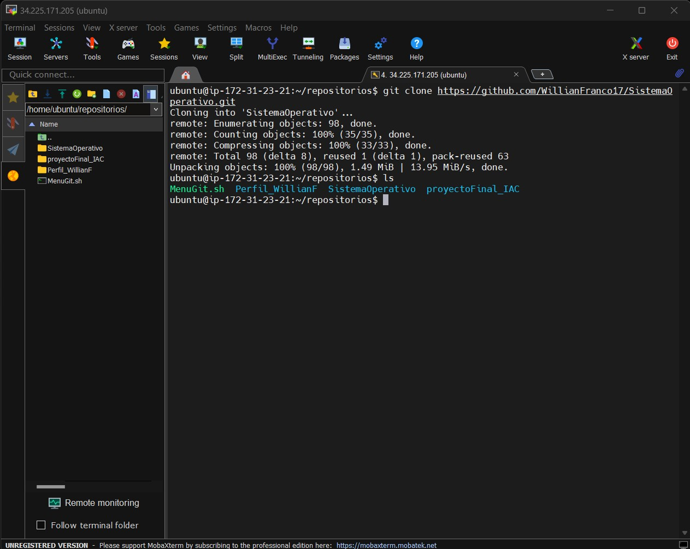


